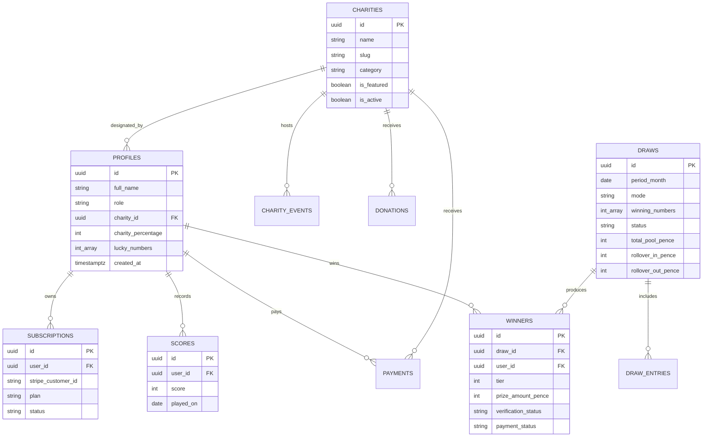
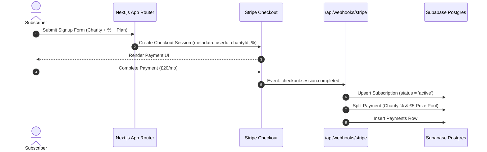
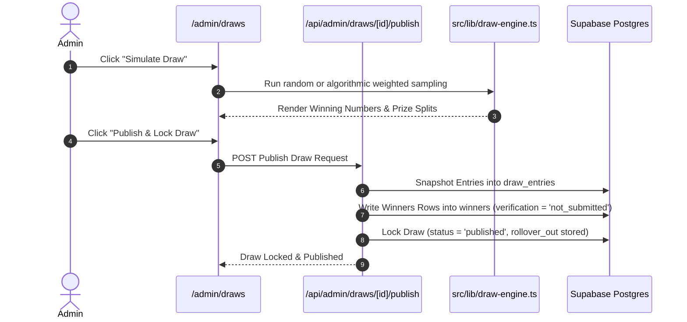

# Digital Heroes Architecture

This document describes the folder layout, database schema ER diagram, request sequence flows, and scalability considerations for the Digital Heroes platform.

---

## Folder Structure

```
digital heroes prd/
├── .env.local
├── .env.example
├── README.md
├── ASSUMPTIONS.md
├── ARCHITECTURE.md
├── package.json
├── tsconfig.json
├── tailwind.config.ts
├── postcss.config.mjs
├── vitest.config.ts
├── supabase/
│   └── migrations/
│       └── 0001_init.sql
├── scripts/
│   └── seed.ts
├── src/
│   ├── app/
│   │   ├── layout.tsx
│   │   ├── page.tsx
│   │   ├── globals.css
│   │   ├── (auth)/
│   │   │   ├── login/page.tsx
│   │   │   ├── signup/page.tsx
│   │   │   └── reset-password/page.tsx
│   │   ├── (public)/
│   │   │   ├── charities/
│   │   │   │   ├── page.tsx
│   │   │   │   └── [slug]/page.tsx
│   │   │   ├── how-it-works/page.tsx
│   │   │   └── results/page.tsx
│   │   ├── dashboard/
│   │   │   ├── page.tsx
│   │   │   └── DashboardClient.tsx
│   │   ├── admin/
│   │   │   ├── layout.tsx
│   │   │   ├── page.tsx
│   │   │   ├── users/page.tsx
│   │   │   ├── draws/page.tsx
│   │   │   ├── charities/page.tsx
│   │   │   ├── winners/page.tsx
│   │   │   └── reports/page.tsx
│   │   └── api/
│   │       ├── stripe/
│   │       ├── webhooks/stripe/
│   │       ├── scores/
│   │       ├── numbers/
│   │       ├── profile/
│   │       ├── winners/
│   │       └── admin/
│   ├── lib/
│   │   ├── supabase/
│   │   ├── stripe.ts
│   │   ├── zod-schemas.ts
│   │   ├── draw-engine.ts
│   │   └── utils.ts
│   ├── components/
│   │   ├── navigation/
│   │   ├── shared/
│   │   └── ui/
│   └── tests/
│       └── draw-engine.test.ts
```

---

## Data Model (Mermaid ER Diagram)



---

## Request Flows

### 1. Subscription & Payment Splitting Flow



### 2. Draw Simulation & Publication Flow



---

## Scalability & Performance Strategy

1. **Database Indexing**:
   - Unique composite index on `scores(user_id, played_on)` for instant duplicate date lookups.
   - Index on `subscriptions(status, user_id)` for high-speed active subscriber filtering during draw simulation.
   - Foreign key indexes on `winners(draw_id)` and `draw_entries(draw_id)`.

2. **Draw Snapshotting Rationale**:
   - Entry configurations and match counts are snapshotted into `draw_entries` at draw execution time. This guarantees that user score updates or profile edits after a draw runs can never corrupt historical draw audits.

3. **Caching & Queue Architecture at Scale**:
   - **Static Revalidation**: Public directory pages (`/charities`, `/results`) use Next.js `revalidate = 60` for ISR caching.
   - **Background Queue**: For scale beyond 100,000 active subscribers, draw calculation and proof image processing would be offloaded to an asynchronous background worker queue (e.g. QStash / BullMQ) with chunked batch DB writes.
